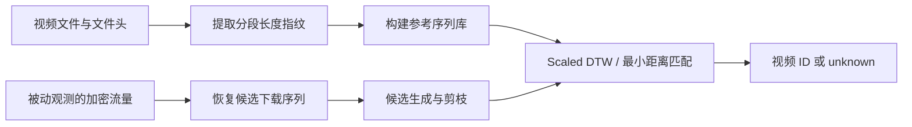
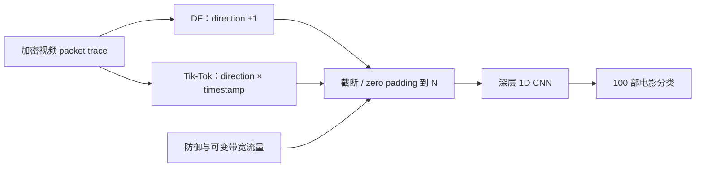
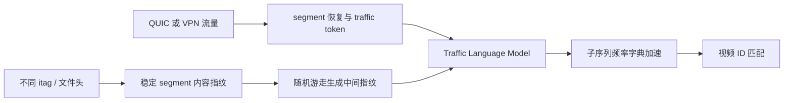

# 加密视频 ID 识别：2018—2026 年代表性方法精讲

> 本文档是 12 页 PPT 的逐页制作稿。`PPT 可见文字`可直接用于页面排版；`讲解备注`仅用于口头补充，不应复制到 PPT。总建议讲解时间为 **18 分 50 秒**。

---

## 第 1 页｜标题页

**建议讲解时间：20 秒**

### PPT 可见文字

**基于加密网络流量侧信道的视频 ID 识别**

### 2018—2026 年代表性方法与技术演进

**精选文献：4 篇传统方法 + 6 篇深度学习方法**

研究对象：YouTube 等在线视频的具体标题或 video ID 
目标环境：被动监听、无解密密钥、QUIC/HTTP/3

### 讲解备注（不放入 PPT）

本次汇报不讨论画面感知哈希或推荐系统，而是讨论仅凭加密流量侧信道识别用户正在观看的具体视频。十篇论文按人工指纹、深度 CNN、结构化表征三个阶段展开，重点关注其对真实 QUIC 场景的迁移价值。

### 来源

- 本页为汇报范围说明，无单篇论文事实。

---

## 第 2 页｜研究问题与技术演进

**建议讲解时间：70 秒**

### PPT 可见文字

### 威胁模型

- **攻击者能力：**被动观察客户端与服务器之间的加密流量，不解密 TLS/QUIC 载荷。
- **可观察信息：**packet length、direction、IAT、Burst、segment/request 边界、连接与 QUIC Stream 行为。
- **识别目标：**从候选库中确定具体视频标题或 video ID，并在开放世界中拒绝未知视频。

### 任务边界

| 任务 | 识别对象 | 本汇报中的作用 |
|---|---|---|
| Video ID Identification | 具体视频标题或 ID | 核心研究对象 |
| Website Fingerprinting | 网站或网页 | 提供序列 CNN 与开放世界方法 |
| Traffic Classification | 应用、协议或业务类型 | 提供通用流量表征方法 |
| QoE Inference | 码率、清晰度、卡顿 | 提供 segment 与 ABR 行为建模 |

### 技术主线

**segment/Burst 显式指纹与匹配** 
→ **人工统计特征 + 传统分类器** 
→ **原始方向/时间序列 + 深层 CNN** 
→ **结构恢复 + token/embedding + 开放世界检索**

> **注意：Deep Fingerprinting 是 Website Fingerprinting 方法迁移论文，不是视频 ID 识别论文。**

### 讲解备注（不放入 PPT）

Video ID 比一般“视频流量分类”更细粒度，也不同于识别网页的 Website Fingerprinting。现代研究的关键不只是选择分类器，而是先从多连接、多路复用和自适应码率流量中恢复可比较的内容结构。

### 来源

- Payap Sirinam et al., *Deep Fingerprinting*, ACM CCS 2018：[DOI](https://doi.org/10.1145/3243734.3243768)
- David Hasselquist et al., *Raising the Bar*, PoPETs 2024：[正式页面](https://petsymposium.org/popets/2024/popets-2024-0112.php)
- Weitao Tang et al., *Zenith*, ACM MM 2024：[DOI](https://doi.org/10.1145/3664647.3680695)

---

## 第 3 页｜C01：Walls Have Ears——segment 长度为何会泄漏视频内容

**建议讲解时间：90 秒**

### PPT 可见文字

**2018｜IEEE INFOCOM** 
**Walls Have Ears: Traffic-based Side-channel Attack in Video Streaming** 
Jiaxi Gu, Jiliang Wang, Zhiwen Yu, Kele Shen｜西北工业大学、清华大学

**背景与问题** 
VBR 编码使不同视频产生特有的码率变化；DASH 虽加密载荷，却仍暴露分段下载形成的流量大小与时间模式。

**输入与方法** 
视频文件 → segment 长度序列 → 网络侧 Burst/下载序列 → 部分序列匹配 → 视频候选。方法利用连续局部片段，无需从视频开头完整观察。

**实验与结论** 
连续观察约 3 分钟时，识别率最高约 **90%**。论文证明“内容相关的分段大小”可成为加密视频指纹，奠定显式指纹路线。

**局限与位置** 
依赖 segment 与 Burst 边界较清晰；面对现代 YouTube 的片段合并、QUIC 多路复用和复杂缓冲时，原始匹配容易失效。

### 讲解备注（不放入 PPT）

这篇论文的核心价值不是某个分类器，而是首次清楚建立“文件侧 segment 序列—网络侧 Burst 序列”的对应关系。后续 RoVIA、HTTP/3 方法与 Zenith 都在解决这种对应关系被合并、扰动或隐藏后的恢复问题。

### 来源

- Jiaxi Gu et al., IEEE INFOCOM 2018, pp. 1538–1546：[DOI](https://doi.org/10.1109/INFOCOM.2018.8486211)

---

## 第 4 页｜C25：RoVIA——适应现代 YouTube 的鲁棒视频识别

**建议讲解时间：110 秒**

### PPT 可见文字

**2024｜Computers & Security 137:103623（online 2023）** 
**Traffic Spills the Beans: A Robust Video Identification Attack Against YouTube** 
Xiyuan Zhang, Gang Xiong, Zhen Li, Chen Yang, Xinjie Lin, Gaopeng Gou, Binxing Fang｜中科院信工所、中国科学院大学等

**旧方法失效原因** 
YouTube 以新接口替代 MPD；多个 segment 可被动态合并下载；启动缓冲与网络状态使流量序列发生伸缩和错位。

**实验结果** 
5 个数据集共 **1,918 个视频、1,343.7 小时**；闭集识别率约 **99.7%**，开放世界约 **96.7%**；固定画质开放世界约 **92.4%**，差网络条件约 **86.3%**。

**贡献、局限与位置** 
用候选生成和 scaled DTW 适应片段合并与时间伸缩；新增视频主要更新指纹库，无需整体重训。局限是依赖文件头、平台接口及指纹可获取性。属于“显式指纹 → 鲁棒序列匹配”的关键节点。

### 讲解备注（不放入 PPT）

RoVIA 的进步在于承认观测序列不会与文件指纹一一对齐，因此先生成合理候选，再进行尺度容忍匹配。开放世界结果很强，但仍建立在可持续获取视频文件侧信息与平台行为相对稳定的前提上。

### 来源

- Xiyuan Zhang et al., *Computers & Security*, 137, 103623：[DOI](https://doi.org/10.1016/j.cose.2023.103623)｜[出版社页面](https://www.sciencedirect.com/science/article/pii/S0167404823005333)

---

## 第 5 页｜C26：面向 HTTP/3 多路复用的加密视频识别

**建议讲解时间：100 秒**

### PPT 可见文字

**2024｜计算机学报 47(7):1640–1664** 
**一种基于 HTTP/3 传输特性的加密视频识别方法** 
吴桦、倪珊珊、罗浩、程光、胡晓艳｜东南大学、紫金山实验室等

**背景与输入** 
HTTP/3 在 QUIC 上加密大部分控制信息，并允许音频、视频与请求多路复用；传统 TCP 流边界和单一 Burst 不再等同于媒体块。输入为可见传输行为、方向、长度和时序。

**核心流程** 
HTTP/3 控制/传输特征 → 请求与音视频块恢复 → **CAVCL 合并音视频块长度修正** → 键值型明文指纹库 → 快速查找视频 ID。

**实验与结果** 
构建 **362,502 个 YouTube** 真实指纹和 283,895 个 Facebook 指纹；YouTube 实验接近 **99% accuracy、100% precision、99.32% F1**，平均识别耗时低于 **0.4 秒**。

**结论与位置** 
贡献是把协议行为恢复显式纳入指纹构造，直接面向 HTTP/3。局限是高度依赖具体协议实现、块合并规律和可维护的明文指纹库；属于“协议结构恢复 + 大规模指纹检索”。

### 讲解备注（不放入 PPT）

本篇与 RoVIA 的共同点是都保留显式指纹，但它更强调 HTTP/3 实现细节：先判断请求和媒体块，再修正合并长度。其规模和速度具有工程吸引力，不过协议栈或平台传输策略变化可能直接破坏规则。

### 来源

- 吴桦等，《计算机学报》2024，47(7):1640–1664：[DOI 10.11897/SP.J.1016.2024.01640](https://doi.org/10.11897/SP.J.1016.2024.01640)｜[正式 PDF](https://cjc.ict.ac.cn/online/onlinepaper/wh-202479163443.pdf)

---

## 第 6 页｜C40：I Know What You Watch——Burst timing 与 LightGBM

**建议讲解时间：90 秒**

### PPT 可见文字

**2025｜IEEE DSC，pp. 191–198** 
**I Know What You Watch: Finding Video Titles in Encrypted Traffic** 
Likun Liu, Jingwei Li, Mengmeng Ge, Zhichao Hu, Xiangzhan Yu｜哈尔滨工业大学、今日头条科技有限公司

**研究问题** 
端到端网络越来越复杂，完整 segment 恢复成本较高；论文考察加密视频流中的内在 Burst timing 是否足以区分具体标题。

**输入与方法** 
加密流量 → Burst 划分 → 时间间隔、持续时间及统计特征 → 特征筛选 → **LightGBM** 多分类器 → 视频标题。

**实验与结果** 
采集 **10,000 条 YouTube 流**，采用五折交叉验证及 20% 测试集，报告 **98.77%** 的代表性结果。

**结论与位置** 
说明精心设计的时间特征与树模型仍是快速、可解释的强基线。局限是随机划分可能混入同一采集条件，跨日期、跨网络和新增标题的泛化能力仍需验证。属于“人工特征 + 传统机器学习”。

### 讲解备注（不放入 PPT）

这篇论文提醒我们，深度学习并不自动优于特征工程。LightGBM 训练和推理成本低，也能分析特征重要性。但高结果必须结合数据划分理解；若训练集和测试集共享采集环境，模型可能学习环境而非内容本身。

### 来源

- Likun Liu et al., IEEE DSC 2025, pp. 191–198：[DOI](https://doi.org/10.1109/DSC67331.2025.00033)

---

## 第 7 页｜C02 + T03：从早期序列网络到深层流量指纹 CNN

**建议讲解时间：120 秒**

### PPT 可见文字

| C02｜Deep Content | T03｜Deep Fingerprinting |
|---|---|
| **2018，IEEE NCA** *Deep Content: Unveiling Video Streaming Content from Encrypted WiFi Traffic* Ying Li et al.｜UTS、悉尼大学、DSTG、Data61-CSIRO | **2018，ACM CCS** *Deep Fingerprinting: Undermining Website Fingerprinting Defenses with Deep Learning* Payap Sirinam et al.｜RIT、UT Arlington |
| **问题：**无需加入 Wi-Fi 网络，仅监听加密 MAC/网络帧，能否识别播放内容？ | **问题：**Tor 防御下，端到端 CNN 能否自动学习网站流量指纹？ |
| **输入：**Wi-Fi frame length、direction、time。 **方法：**定长序列 → MLP/RNN → 视频类别。 | **输入：**前 5,000 个 Tor cell 的方向序列（±1），截断或补零。 **方法：**4 个卷积块、8 层 1D CNN → 全连接分类。 |
| **结果：**在闭集 YouTube 内容识别中达到与有线 CNN 相近的效果，并显著降低计算和时间开销。 | **结果：**无防御场景超过 98%；同时评估 WTF-PAD、Walkie-Talkie 与 20,000 个非监控网站的开放世界。 |
| **位置与局限：**早期 MLP/RNN 视频内容识别；易受设备、位置和采集环境捷径影响。 | **位置与局限：**提供方向序列 CNN 强基线；Tor cell 与网页访问假设不能直接套用到 ABR 视频。 |

> **T03 是 Website Fingerprinting 方法迁移论文，不属于视频 ID 核心语料；其价值是提供后续视频 CNN 的架构源头。**

### 讲解备注（不放入 PPT）

C02 说明原始帧序列可以直接输入神经网络；T03 则把深层一维 CNN 做成流量指纹领域的强基线。真正迁移到视频时，不能只复制网络结构，还要重新处理包长、播放时长、ABR 和 segment 结构。

### 来源

- Ying Li et al., IEEE NCA 2018：[DOI](https://doi.org/10.1109/NCA.2018.8548317)｜[公开页面](https://opus.lib.uts.edu.au/handle/10453/128553)
- Payap Sirinam et al., ACM CCS 2018：[DOI](https://doi.org/10.1145/3243734.3243768)｜[公开 PDF](https://mjuarezm.github.io/assets/pdf/ccs18.pdf)

---

## 第 8 页｜C32：Raising the Bar——把 DF/Tik-Tok 迁移到视频流量

**建议讲解时间：120 秒**

### PPT 可见文字

**2024｜Proceedings on Privacy Enhancing Technologies, 2024(4):167–184** 
**Raising the Bar: Improved Fingerprinting Attacks and Defenses for Video Streaming Traffic** 
David Hasselquist, Ethan Witwer, August Carlson, Niklas Johansson, Niklas Carlsson｜Linköping University、Sectra Communications

**数据与结果** 
LongEnough：100 部 YouTube 电影，每部取前 10 分钟；2 秒 segment、1/2/4 Mbps，未防御集 10,000 条，总数据约 2,300 小时。N=5k/10k/30k 时，DF 约 **0.831/0.928/0.966**，Tik-Tok 约 **0.916/0.951/0.970**。

**批判与科技树位置** 
首次系统展示 DF/Tik-Tok 在视频上的强攻击及防御上界，是“网站 CNN → 视频 CNN”的迁入节点。但固定播放 offset、受控服务器和闭集设定可能降低任务难度；不同视频的最大 segment size 还可能形成捷径。

### 讲解备注（不放入 PPT）

结果随输入长度增加而提高，说明模型积累的是较长时间的内容节奏。需要特别区分“CNN 确实学习了复杂序列”与“数据中存在尺寸捷径”这两种解释；该论文更适合看作强攻击上界，而非直接部署结果。

### 来源

- David Hasselquist et al., PoPETs 2024：[DOI](https://doi.org/10.56553/popets-2024-0112)｜[正式页面](https://petsymposium.org/popets/2024/popets-2024-0112.php)｜[代码](https://github.com/trafnex/raising-the-bar)

---

## 第 9 页｜C28：Zenith——从精确序列匹配到 Traffic Language Model

**建议讲解时间：120 秒**

### PPT 可见文字

**2024｜ACM Multimedia，pp. 7200–7209** 
**Zenith: Real-time Identification of DASH Encrypted Video Traffic with Distortion** 
Weitao Tang, Jianqiang Li, Meijie Du, Die Hu, Qingyun Liu｜中科院信工所、中国科学院大学、CNCERT/CC

**核心思想** 
将受丢包、重传、分辨率变化和低带宽影响的流量表示为 token 序列；用随机游走扩充“中间指纹”，再依据局部子序列出现频率进行鲁棒匹配。这里的 Language Model 是结构化序列模型，**不是大语言模型**。

**实验、结论与局限** 
约 30 秒观测时报告 **97.32%** 的代表性结果，论文设置下检索速度约 **9.87 μs**；覆盖 QUIC、VPN 与多种失真。它是“显式内容指纹 + 流量 token 学习”的融合节点，但仍依赖 segment/token 提取、itag 与指纹库，长期跨平台漂移未解决。

### 讲解备注（不放入 PPT）

Zenith 没有抛弃指纹，而是把指纹从必须精确对齐的数值序列改造成可容忍缺失和插入的 token 语言。其优势来自结构先验与频率索引的结合；若前端 segment 恢复错误，后端模型仍会受到连锁影响。

### 来源

- Weitao Tang et al., ACM MM 2024：[DOI](https://doi.org/10.1145/3664647.3680695)｜[公开正式稿](https://openreview.net/pdf/6f1e0cd0478b276d457d99942c4607afc3ea172e.pdf)

---

## 第 10 页｜C35 + C37：可增量 embedding 与现实代理流量流水线

**建议讲解时间：120 秒**

### PPT 可见文字

| C35｜Low-dimensional Embedding | C37｜SCEP-TI |
|---|---|
| **2025，IEEE TIFS 20:8280–8295（online 2024）** *The Analysis of Encrypted Video Stream Based on Low-Dimensional Embedding Method* Luming Yang et al.｜国防科技大学 | **2025，Computer Networks 271:111630** *SCEP-TI: A Side-channel Attack on Encrypted Proxy Video Streams for Video Title Identification* Yi Zhang et al.｜东南大学、紫金山实验室 |
| **问题：**类别库扩大后，端到端分类器重训成本高，变长流量也不便直接检索。 | **问题：**代理、背景流、非对称路由和单向观测使媒体流难以分离。 |
| **输入与方法：**Byte Rate Sequence → RNN + self-attention → triplet learning → **8 维 embedding** → 聚类或 ANN 检索。 | **输入与方法：**客户端 request 分段 → 轻量相似度筛除背景流 → 单向 segment 序列 → CNN 标题分类。 |
| **结果：**相似度阈值识别约 **96.89%**，并验证分类和聚类能力。新视频可通过新增向量进入检索库。 | **结果：**覆盖 DASH/HLS、YouTube/Facebook/RedNote 和开放世界，三个平台报告约 **93%/94%/98%**。 |
| **位置与局限：**“分类 → 度量空间检索”；跨域稳定性与 unknown 阈值仍需校准。 | **位置与局限：**“流量清洗 + 结构恢复 + CNN”；依赖 request 可分性及代理实现稳定。 |

**页面结论：**C35 优先降低新类别更新成本，C37 优先解决真实网络中的流量分离；二者分别代表“可增量检索”和“现实环境流水线”。

### 讲解备注（不放入 PPT）

两篇论文解决的不是同一瓶颈：C35 把标题变成低维向量，使大库检索和聚类更自然；C37 则把精力放在分类之前的请求分段与背景流过滤。未来系统可以将二者串联，而不是二选一。

### 来源

- Luming Yang et al., IEEE TIFS 2025：[DOI](https://doi.org/10.1109/TIFS.2024.3515816)
- Yi Zhang et al., *Computer Networks* 2025：[DOI](https://doi.org/10.1016/j.comnet.2025.111630)｜[出版社页面](https://www.sciencedirect.com/science/article/pii/S1389128625005973)｜[代码](https://github.com/Zzzyyzz/SCEP-TI)

---

## 第 11 页｜十篇论文横向比较：比较能力边界，而不是比较 accuracy

**建议讲解时间：100 秒**

### PPT 可见文字

> 不同论文的数据集、类别规模、观察时间和任务边界不同，因此不按 accuracy 排名。

| 论文 | 观察单位 / 输入 | 结构依赖 | 新类别更新 | 开放世界 | 跨网络与现实性 | 可解释性 | QUIC 适配性 |
|---|---|---|---|---|---|---|---|
| C01 Walls Have Ears | segment/Burst 长度序列 | 高：需清晰分段 | 新增指纹，成本低 | 较弱 | 简化 DASH 条件 | 高 | 低 |
| C25 RoVIA | 文件头指纹、参考/候选序列 | 高：容忍动态合并 | 更新指纹库 | 已评估 | 固定画质、差网络 | 高 | 中：需适配后端 |
| C26 HTTP/3 方法 | 请求、音视频块、CAVCL | 高：依赖协议恢复 | 更新键值库 | 大库检索，非完整 unknown | YouTube/Facebook | 高 | 很高 |
| C40 I Know What You Watch | Burst timing 统计特征 | 中 | 通常需重训 | 不充分 | 跨日期未知 | 中—高 | 中 |
| C02 Deep Content | Wi-Fi 帧长、方向、时间 | 低：无显式分段 | 需重训 | 未评估 | 无线侧监听；环境捷径风险 | 低—中 | 中 |
| T03 Deep Fingerprinting | Tor cell 方向序列 | 低 | 需重训 | 网站场景已评估 | Tor 防御条件 | 低 | 仅架构迁移 |
| C32 Raising the Bar | direction、direction×time | 中：隐式学习视频节奏 | 需重训 | 主要为闭集上界 | 防御、可变带宽；受控环境 | 低—中 | 中—高 |
| C28 Zenith | segment 指纹、traffic token | 高 | 主要增加指纹 | unknown 机制有限 | QUIC、VPN、分辨率与低带宽 | 中—高 | 高 |
| C35 Embedding | BRS、8 维 embedding | 中 | 新增原型/向量，成本低 | 阈值与聚类，仍需校准 | 长期漂移未充分验证 | 中 | 高：适合检索层 |
| C37 SCEP-TI | request、单向 segment 序列 | 高 | CNN 通常需重训 | 已评估 | 代理、背景流、单向路径 | 中 | 中—高 |

### 讲解备注（不放入 PPT）

这张表应重点看三项：是否依赖结构恢复、新视频是否必须重训、开放世界是否真正拒绝 unknown。显式指纹可解释且易更新，CNN 擅长吸收复杂扰动，embedding 和结构化模型则尝试结合两者优势。

### 来源

- 表中判断依据为前述十篇论文的任务定义、方法和实验条件；“QUIC 适配性”等级属于跨论文综合判断，并非论文原文排名。

---

## 第 12 页｜结论与 2026 前沿：面向真实 QUIC 的组合式系统

**建议讲解时间：70 秒**

### PPT 可见文字

### 三点结论

1. **显式指纹没有被深度学习淘汰。**它仍提供高可解释性、低成本更新和候选库构建能力。
2. **决定上限的往往是流量表示。**从 packet/Burst 到 request、segment、token 和 embedding，结构恢复比单纯更换分类器更关键。
3. **真实系统应采用组合式路线：** 
   协议/行为结构恢复 → 大库候选检索 → 学习模型重排 → unknown/OOD 拒识 → 跨日期增量更新。

### 2026 前沿方向（不属于十篇主选文献）

- **GAN + OOD：**联合增强样本与未知流量检测，但现有识别和 OOD 指标仍显示真实泛化困难。
- **Blazer：**以 LLM 建模 mixed-segment transmission pattern，探索更长程的结构关系。
- **Strainer：**针对 mixed-segment 传输进行结构分离与识别，继续推进复杂多路复用场景。

### 对 YouTube QUIC 项目的建议

**先恢复 request/segment 候选结构，再采用 embedding/ANN 缩小候选集，最后使用序列模型重排并显式校准 unknown 阈值；评估必须跨日期、网络、设备与协议版本。**

### 讲解备注（不放入 PPT）

未来突破点不是单一更大的模型，而是让前端结构恢复、候选检索和开放集判断共同工作。2026 年方法说明 mixed-segment 与 OOD 已成为焦点，但是否能跨平台长期稳定，仍需严格的时间外测试证明。

### 来源

- *GAN-Enhanced Deep Learning for Secure and Robust Encrypted Video Traffic Analysis*, IEEE ICIT 2026：[DOI](https://doi.org/10.1109/ICIT68548.2026.11577726)
- *Blazer: Encrypted Video Traffic Identification for Mixed Segment Transmission Pattern Based on LLM*, ACM ICMR 2026：[DOI](https://doi.org/10.1145/3805622.3810657)
- *Strainer: Encrypted Video Traffic Identification for Mixed Segment Transmission Pattern*, ACM SIGKDD 2026：[DOI](https://doi.org/10.1145/3770855.3817723)

---

> **AI 辅助说明：**本文档使用生成式 AI 协助重组页面结构、压缩文字与统一表达；论文题目、书目信息、方法和结果应以所列正式来源为最终依据。
